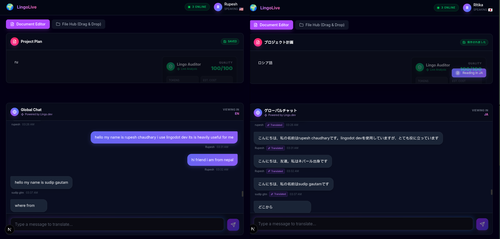
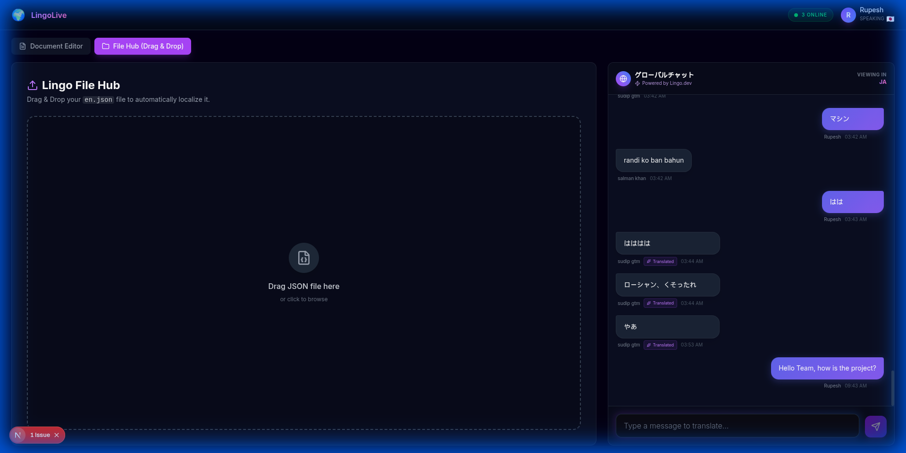

# LingoLive 🌍

**The Borderless Collaboration Workspace for Global Teams.**

LingoLive is a real-time collaboration platform that eliminates language barriers in remote work. It combines instant chat translation, voice synthesis, and developer tools into a single, seamless workspace.

Built for the **Lingo.dev Hackathon**.

---

## 🎥 Video Demo

[](https://www.youtube.com/watch?v=YOUR_VIDEO_ID)
*(Click the image to watch the demo)*

---

## 🛠 Features

### 1. Real-Time Multilingual Chat

- **Zero-Latency Experience:** Messages appear instantly (Optimistic UI) while translation happens in the background.
- **Context-Aware:** Uses the Lingo Engine to understand context (e.g., distinguishing "Bank" as a financial institution vs. a river bank).
- **Cross-Language Support:** Users see messages in their preferred language (English, Spanish, French, German, Japanese, Nepali).

### 2. Native Text-to-Speech (TTS)
- **"Listen" to any Message:** Integrated browser-native Speech Synthesis.
- **Language Auto-Detection:** Automatically selects the correct voice pack (e.g., `ja-JP` for Japanese) to ensure accurate pronunciation.
- **Accessibility:** Makes global communication accessible to everyone.

### 3. Developer File Hub (Drag & Drop)

- **JSON Localization Automator:** Solves the pain of manual software localization.
- **Visual Split-View:** Compare original `en.json` vs translated `es.json` side-by-side.
- **Recursive Parsing:** Smartly handles nested JSON objects preventing crashes on complex config files.
- **One-Click Download:** Get production-ready localized files in seconds.

### 4. Lingo Auditor (CLI & MCP)
- **Intelligent Code Scanning:** A custom script (`audit-cli.js`) that scans the codebase for hardcoded strings and brand violations.
- **CI/CD Integration:** Runs automatically in GitHub Actions to prevent non-localized code from hitting production.
- **MCP Architecture:** Built with Model Context Protocol principles for future AI agent integration.

---

## 💻 Tech Stack

- **Framework:** Next.js 14+ (App Router)
- **Styling:** Tailwind CSS + Framer Motion (Glassmorphism Design)
- **Backend/Realtime:** Supabase (PostgreSQL + Realtime Channels)
- **Lingo.dev Ecosystem:**
  - **SDK:** `lingo.dev/sdk` (Real-time Context & Translation)
  - **CLI:** Custom `audit-cli.js` (Built with Node.js)
  - **MCP:** Model Context Protocol Server (`scripts/mcp-server.js`)
  - **GitHub Actions:** Automated CI pipeline (`.github/workflows/lingo.yml`)
- **CI/CD:** GitHub Actions (Automated Audits)

---

## 🚀 Getting Started

### 1. Clone the repository
```bash
git clone https://github.com/Rupe88/lingolive-hackathon.git
cd lingolive-hackathon
```

### 2. Install Dependencies
```bash
npm install
```

### 3. Environment Setup
Create a `.env.local` file in the root directory:

```env
NEXT_PUBLIC_LINGO_API_KEY=your_lingo_key
NEXT_PUBLIC_SUPABASE_URL=your_supabase_url
NEXT_PUBLIC_SUPABASE_ANON_KEY=your_supabase_anon_key
```

### 4. Run Locally
```bash
npm run dev
```
Open [http://localhost:3000](http://localhost:3000) in your browser.

---

## 🧪 How to Demo

1. **Login:** Enter your name and select a language (e.g., "Japanese").
2. **Chat:** Type a message in English. See it appear in Japanese for the receiver. Click the "Speaker" icon to hear it.
3. **File Hub:**
   - Go to the **File Hub** tab.
   - Drag & Drop the provided `demo-assets/en.json` file.
   - Click **Start Localization**.
   - See the real-time split view comparison and download the result.

---

---

## 🎉 Fun Fact
During testing, **8 of my college friends** joined the same LingoLive room. We spent hours chatting, shouting random words, and testing the limits of the translation engine (even with some *colorful* language 😂). It proved that language barriers can't stop a good time!

---

## 📄 License
MIT License. Created by Rupesh for the Lingo.dev Hackathon 2026.
